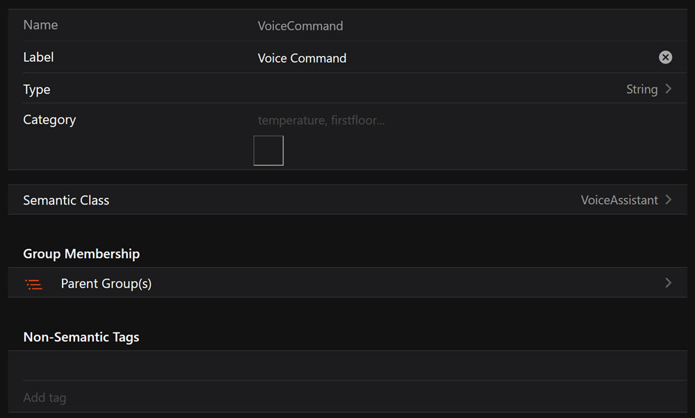
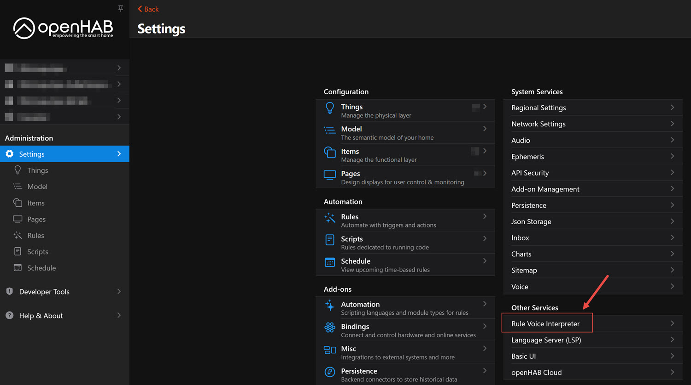
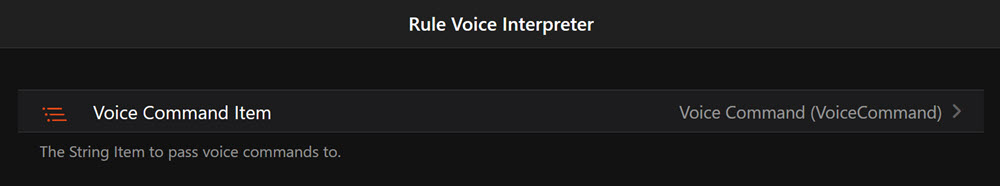

## Description

Cuevox is a simple but extensible voice control tool for openHAB. The [OH Android App](https://community.openhab.org/t/cuevox-a-rule-based-voice-interpreter-4-0-0-0-4-9-9-9/161308) can be used to [send voice commands](https://community.openhab.org/t/cuevox-a-rule-based-voice-interpreter-4-0-0-0-4-9-9-9/161308) to OH and interpret them using voice command rules that can be easily extended in the rule script. Apart from the voice command itself, no OH internal data needs to be sent to any external API.

The voice command is split in tokens, which are tried to be matched for the pre-defined rules.

Features:

* Supported languages: English, German
* Send ON/OFF or UP/DOWN command to a single item (matched by label or synonym)
  * > turn off the kitchen light

  * > lower the living room blinds

  * Assuming in above examples that `kitchen light` and `living room blinds` are the labels of single items.
* Turn all lights on/off or raise/lower all roller shutters *in a group, e.g. a location*.
  * All descendant items of the respective group can be matched.
  * > turn off the light in the first floor
    * This will match all `Switch` items with the `Light` tag.
  * > raise all shutters in the living room
  * Assuming in above examples that `first floor` and `living room` are group items.
* Item matching via the item label or `Synonym` metadata.
* Create custom voice command rules, including custom script execution upon matching.

## Examples (English)

### Light Controls

**Turning lights on/off in a specific location:**

* “Turn on all the lights in the living room.”
* “Switch the light off in the kitchen.”
* “Turn all lights off in the bedroom.”
* “Switch the lights on.”

**Turning lights on/off with labels:**

* “Turn the kitchen light off.”
* “Switch on the bedroom lights.”
* “Turn off the living room lights.”

### Rollershutter Controls

**Raising or lowering rollershutters:**

* “Put the rollershutter up in the office.”
* “Pull all the blinds down in the living room.”
* “Lower the shutters in the bedroom.”
* “Raise all the roller blinds in the kitchen.”

**Specifying rollershutters by label:**

* “Lower the kitchen shutters.”
* “Raise the office blinds.”
* “Pull the living room blinds down.”
* “Put the bathroom roller shutter up.”

### Generic Item Commands

**Turning items on/off:**

* “Turn the fan on.”
* “Switch the heater off.”
* “Turn the lamp off.”

**Adjusting items up/down:**

* “Pull the screen down.”
* “Lower the projector.”
* “Raise the curtain.”

## Examples (German)

### Lichtsteuerung (Light Controls)

**Schalten von Lichtern ein/aus in einem bestimmten Raum:**

* “Schalte alle Lichter im Wohnzimmer ein.”
* “Mach das Licht in der Küche aus.”
* “Schalt alle Lampen im Schlafzimmer aus.”
* “Mach die Lichter im Flur an.”

**Schalten von Lichtern mit Labels:**

* “Schalte die Wohnzimmerlampe aus.”
* “Mach das Küchenlicht an.”
* “Schalt das Schlafzimmerlicht ein.”
* “Mach die Flurlampe aus.”

### Rolladensteuerung (Rollershutter Controls)

**Hoch- oder Herunterfahren von Rollos in einem Raum:**

* “Fahr die Rollos im Wohnzimmer hoch.”
* “Mach das Rollo im Schlafzimmer runter.”
* “Fahre die Rolladen in der Küche hoch.”
* “Fahr die Rolläden im Büro herunter.”

**Hoch- oder Herunterfahren von Rollos mit Labels:**

* “Fahr das Küchenrollo hoch.”
* “Mach den Wohnzimmerrolladen runter.”
* “Fahre die Schlafzimmerrolläden herunter.”
* “Fahr die Bürorollos hoch.”

### Generische Befehle (Generic Commands)

**Ein- und Ausschalten von Geräten:**

* “Schalte den Ventilator ein.”
* “Mach die Heizung aus.”
* “Schalt die Lampe an.”

**Hoch- oder Herunterfahren von Geräten:**

* “Fahre den Bildschirm runter.”
* “Mach die Leinwand hoch.”
* “Fahr die Jalousie herunter.”

## Requirements

Language: JavaScript, Scripting with openhab-js

Dependencies:

* JavaScript Scripting add-on
* openhab-js 4.5.1 or later
* A voice command *String* item, which stores the spoken text
* The voice command item configured under *Rule Voice Interpreter* and the openHAB Android App, connected to your OH instance and [configured to send voice commands to OH](https://www.openhab.org/docs/apps/android.html#send-voice-commands-to-openhab)
  * Alternatively: any other system that captures your voice and stores the spoken text in the voice command item.

### How to setup the voice command item to use with the openHAB Android App

1. Create the item, called e.g. “VoiceCommand”

   

2. Configure it in the settings as target for the rule voice interpreter: Settings->Rule Voice Interpreter->Voice Command Item

   
   →

   

### Create Custom Voice Command Rules

As of now, custom voice command rules must be defined in the inline script.
**NOTE**: If the rule template has been updated and you’d like to update your rule, you must create a new rule from the latest template. Any changes to your previous rule/script, particularly your custom voice command rules, must be copied from the previous rule script to the newly created rule script.

At the very bottom of the script, the `// RULES` section defines the rules. Below, there is a section for your custom voice command rules:

```
  // ** CUSTOM RULES *********************
  // Add your rules here
  // *************************************
```

You can define variables for common expressions or reuse the ones from the pre-defined rules and add the rule to the `rbi` object (the instance of the `RuleBasedInterpreter` class), e.g.

```javascript
let the = opt("the");
let lowerRaise = alt(cmd("lower", DOWN),cmd("raise", UP));
rbi.addRule(seq(lowerRaise, the, itemLabel()));
```

```javascript
    /**
     * Adds a rule.
     * Either the expression must contain a function to execute (e.g. send a command) or a specific function must be given.
     * @param {Expression} expression 
     * @param {function} executeFunction    If a specific function is given, it will override any function from the expression.
     */
    addRule(expression, executeFunction)
```

The following expressions are available to define a rule:

```javascript
/**
 * Creates an alternative expression. All given expressions can be used alternatively, i.e. using an OR logic.
 * @param  {...Expression} expressions Any expression types.
 */
function alt(...expressions)
/**
 * Creates a sequential expression. All given expressions are processed sequentially in that order.
 * @param  {...Expression} expressions Any expression types.
 */
function seq(...expressions)
/**
 * Creates an optional expression. The given expression is not mandatory for a match.
 * @param  {Expression} expression 
 */
function opt(expression)
/**
 * Creates a command expression.
 * If the given expression is matched, the given command is sent to all found items of that rule.
 * @param {Expression} expression 
 * @param {string} command 
 */
function cmd(expression, command)
/**
 * Match one or more items by label, synonym, type, tag, or expression.
 *
 * @param {Object} [options={}]
 * @param {boolean} [options.include=true]
 *     Whether to include matched items in execution parameters.
 * @param {boolean} [options.matchMultiple=false]
 *     Whether to allow multiples item matches (default: false = match only one item).
 * @param {string|string[]} [options.type=null]
 *     Restrict to specific item type(s). Single string = exact match, array = match any.
 * @param {string|string[]} [options.tag=[]]
 *     Restrict to items with these tag(s).
 * @param {"all"|"any"} [options.tagMode="all"]
 *     Whether all tags or any tag must match.
 *
 * @param {Object} [expressionOptions={}]
 * @param {Expression|null} [expressionOptions.expr=null]
 *     If provided, tokens are matched against this expression instead of the item label.
 * @param {null|"last"|"one"|"all"} [expressionOptions.groupContext=null]
 *     - `null`: No group required (default).  
 *     - `"last"`: Require a group and use the last matched one.  
 *     - `"one"`: Require exactly one matched group; log error if multiple are matched.  
 *     - `"all"`: Require one or more groups; return descendants of all matched groups.
 *
 * @returns {Expression}
 * @throws Logs an error and fails the matching if invalid parameters are provided.
 */
function item(options = {}, expressionOptions = {})
```

## Future Improvements

The rule template source code is maintained at GitHub: [JanMattner/voice-control-openhab: A simple but extensible rule based voice control tool for openHAB.](https://github.com/JanMattner/voice-control-openhab)
Feel free to add your ideas for improvements there or in this forum thread.

* Add more out of the box rules, including other languages
* Verify rules in various scenarios
* Include custom rules from a separate script, so the update of the rule template is easier without the risk of data loss

## Changelog

### Version 2.2

* match version to GitHub repo
* Bugfixes:
  * [itemLabel isGroup parameter is not consistent](https://github.com/JanMattner/voice-control-openhab/issues/26)
  * [getItemByLabelOrSynonym: if multiple items are remaining, prefer exact matches](https://github.com/JanMattner/voice-control-openhab/issues/27)
* Enhancements:
  * [Have interpretUtterance return result of actions and success status](https://github.com/JanMattner/voice-control-openhab/issues/20)
  * [Ignore non-alphabetical characters](https://github.com/JanMattner/voice-control-openhab/issues/12)

### Version 0.2

* rename and update documentation

### Version 0.1

* initial release

## Resources

[https://raw.githubusercontent.com/JanMattner/voice-control-openhab/main/rule-template/cuevox.yaml](https://raw.githubusercontent.com/JanMattner/voice-control-openhab/main/rule-template/cuevox.yaml)